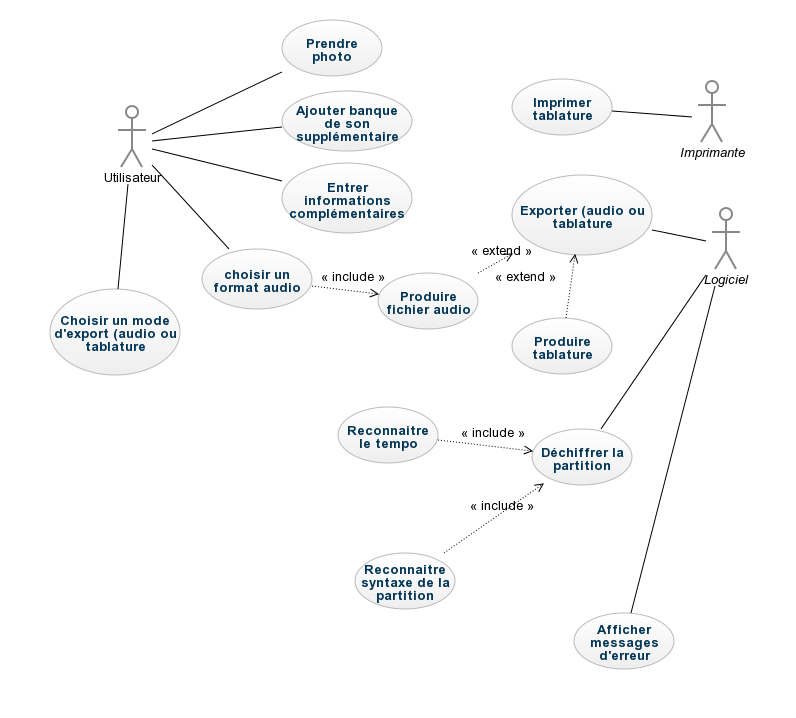

#I	Fondements du projet
##1. But du projet
###a. Problème de l’utilisateur ou contexte du projet 
Grâce à ce produit, nous voulons accompagner les jeunes musiciens à progresser dans leur façon de jouer de la guitare ou de la basse, sans avoir à se casser les dents sur l'apprentissage du solfège.
###b. Objectifs du projet
L'objectif final de ce produit est de permettre à n'importe qui de décrypter une partition de musique. Pour cela notre produit réalisera une tablatures, un fichier midi et un fichier mp3 de la partition.
##2. Personnes et organismes impliqués dans les enjeux du projet 
###a. Maître d’ouvrage
djowcompany
###b. Acheteur
Toute personne jouant d'une guitare ou d'une basse / Ecole de musique / Professeur de musique
###c. Autre parties prenantes
N/A
##3. Utilisateurs du produit
###a.	Utilisateurs directs du produit
L'objectif principal est d'implanter le produit sur le marché français. Visant un public plutôt jeune et amateur, nous espérons atteindre les 50 000 à 100 000 ventes sur 2 ans.
Dans ce second temps, l'objectif et de s'implanter à l'internationnal (et particulièrement aux USA) et atteindre les 500 000 ventes sur les 5 prochaines années.
###b. Priorité assignée aux utilisateurs
Produit qui doit être très instinstif à utiliser pour l'utilisateur final. Si 5min un utilisateur n'a pas compris comment il peut avoir sa tablature, le produit n'est pas assez claire.
###c. Implication nécessaire de la part des utilisateurs dans le projet
Aucun. Uniquement fournir les partitions au produit fini
###d. Utilisateurs concernés par les opérations de maintenance du produit
Les utilisateurs n'auront aucune opération de maintenance à faire. Cependant le prestataire devra s'occuper durant un 1 an de la maintenance du produit, tout en formant notre personnel qui s'en chargera la suite.
#II	Contraintes sur le projet 
##4. Contraintes non négociables
###a. Contraintes sur la conception de la solution
| ID | Description                                                                                                                                | Justification                                                                                                                     | Critère de satisfaction                                                                                                               |
|----|--------------------------------------------------------------------------------------------------------------------------------------------|-----------------------------------------------------------------------------------------------------------------------------------|---------------------------------------------------------------------------------------------------------------------------------------|
| 1  | Le produit doit fonctionner autant sur Android (depuis la version 4.0 "ICS"), IOS (depuis la version 7), que Windows Phone (toute version) | Assurer la compatibilité avec un maximum d'appareil mobile, et donc rendre l'application disponible pour un maximum d'utilisateur | L'application est disponible et téléchargeable sur tout appareil disposant du système d'exploitation dans sa version minimale requise |
| 2  | Les fonctionnalités proposées par le produit doivent être identiques quelle que soit la plateforme (Android, IOS ou Windows Phone)         | Un utilisateur quelconque a accès à toutes les fonctionnalités de l'application, peu importe l'appareil qu'il utilise             | Les mises à jours de l'application sont déployées à la même date sur chaque plateforme                                                |
###b. Environnement de fonctionnement du système actuel
Le produit peut fonctionner sur Android, IOS et Windows Phone de façon transparente pour l'utilisateur.
###c. Applications « partenaires » (avec lesquelles le produit doit collaborer)
Le produit pourra interagir avec l'explorateur de fichier du système d'exploitation, l'application appareil photo du mobile ainsi que la galerie de photos pour permettre l'importation de la photographie de la partition. L'application devra supporter la lecture du fichier audio produit à l'aide du lecteur de musique intégré du système d'exploitation du mobile.
###d. « COTS » : Progiciels ou composants commerciaux
Aucun progiciel ou composant commercial est imposé, vive l'Open Source.
###e. Lieux de fonctionnement prévus
Le produit fonctionannt sur un appareil mobile, il est amené à fonctionner en tout lieu et toutes circonstances.
###f. De combien de temps les développeurs disposent-ils pour le projet ?
Les développeurs disposent de 3 mois pour réaliser une première version du logiciel, qui implémente une des fonctionnalités principales du produit final. 
###g. Quel est le budget affecté au projet ?
Le budget affecté au projet est fixé à 30 000€.
##5. Glossaire et conventions de dénomination
* Partition : document décrivant une composition musicale
* Banque de sons : ensemble de sons basiques qui assemblés permettent de reproduire une mélodie décrite sur une partition
* Tablature :  partition instrumentale dont le procédé d'écriture permet d'utiliser les instruments sans savoir lire les notes
* MIDI : Musical Instrument Digital Interface, format de fichier dédié à la musique
* Informations complémentaires : informations décrivant avec plus de précision la partition présentée (compositeur, année de composition, etc...).

##6. Faits et hypothèses utiles
###a. Facteurs influençant le produit, mais qui ne sont pas des contraintes imposées sur les exigences
N/A
###b. Hypothèses que l’équipe fait sur le projet 
Le produit va révolutionner le monde la musique.
#III	Exigences fonctionnelles
##7. Portée du travail
###a. La situation actuelle
Pour transformer une partition en tablature, il faut déjà être capable de savoir lire une partition (identifier la clef, l'armure, puis chaque note une à une, c'est à dire la hauteur et le rythme associé). Il faut ensuite à l'aide d'un logiciel d'édition de tablature entrer les notes une part une.
###b. Contexte du travail
N/A
###c. Division du travail en événements métier
N/A
##8. Portée du produit (cas d’utilisations)
###a. Limites du produit : diagramme de cas d’utilisation

###b. Description sommaire des cas d’utilisation

| ID | Catégories                 | Description                                                                  | Justification                                                                                  | Origine | Critères de satisfaction                                               | Contentement MOA | Mécontentement MOA | Exigences Dépendantes  | Exigences conflictuelles |
|----|----------------------------|------------------------------------------------------------------------------|------------------------------------------------------------------------------------------------|---------|------------------------------------------------------------------------|------------------|--------------------|------------------------|--------------------------|
| 01 | Exigence utilisateur       | L'utilisateur doit pouvoir prendre une photo                                 | Besoin d'avoir la photo de la partition                                                        | ELT     | On obtient une photo                                                   | 1                | 5                  | 05 - 06 |                          |

##9. Exigences fonctionnelles et exigences sur les données
###a. Exigences fonctionnelles

| ID | Catégories                 | Description                                                                  | Justification                                                                                  | Origine | Critères de satisfaction                                               | Contentement MOA | Mécontentement MOA | Exigences Dépendantes  | Exigences conflictuelles |
|----|----------------------------|------------------------------------------------------------------------------|------------------------------------------------------------------------------------------------|---------|------------------------------------------------------------------------|------------------|--------------------|------------------------|--------------------------|
| 04 | Exigence fonctionelle      | L'utilisateur peut rajouter une banque de sons alternative                   | Permettre d'enrichir la banque de sons par défaut                                              | ELT     | On peut rajouter une banque de sons au système                         | 4                | 1                  |                        |                          |
| 07 | Exigence fonctionnelle     | Permettre à l'utilisateur de rentrer des informations complémentaires        | Si l'utilisateur désire ajouter des informations manquantes à la partition                     | ELT     | On peut rentrer des informations additionnelles au système             | 3                | 2                  |                        |                          |
| 09 | Exigence fonctionnelle     | Pouvoir exporter la tablature pour l'imprimer                                | Faciliter la lecture de la tablature en pouvant l'exporter                                     | DJO     | Le système exporte correctement la tablature afin de l'imprimer        | 2                | 4                  |                        |                          |
| 11 | Exigence fonctionnelle     | Choix du format du fichier audio (mp3, MIDI, etc...)                         | Le fichier audio peut être lu sur différentes plateformes                                      | MBO     | Différents formats audio sont sélectionnables                          | 3                | 3                  |                        |                     
| 15 | Exigence fonctionnelle     | Choisir entre la production d'une tablature, d'un fichier audio, ou des deux | Laisser le choix à l'utilisateur                                                               | DJO     | L'utilisateur peut sélectionner le mode d'utilisation                  | 2                | 4                  |                        |                          |
#IV	Exigences non fonctionnelles
##10. Ergonomie et convivialité du produit
###a. L’interface
###b. Le style du produit (packaging inclus)
##11. Facilité d’utilisation et facteurs humains 
###a. Facilité d’utilisation
###b. Personnalisation et internationalisation
###c. Facilité d’apprentissage
###d. Facilité de compréhension et politesse
###e. Exigences d’accessibilité
##12. Fonctionnement du produit
###a. Rapidité d’exécution et temps de latence
Le produit doit être relativement rapide. Apris que l'utilisateur a entré la partition, il doit pouvoir dans un délai maximum de 1min avoir une tablature et un fichier midi. Pour un fichier audio, une attente de 2min pourrait être accepté.
Bien évidemment une fluidité dans les menus du produit sera exigée.
###b. Exigences critiques de sûreté
Aucune
###c. Précision et exactitude
Tout d'abord, la photo prise de la partition devra être de bonne qualité, pour que le produit puisse bien traiter ces informations.
Pour la tablature, il faut qu'elle soit tout simplement jouable au visuel.
Les fichiers midi et audios devront quand à eux avoir un son correct, et bien évidemment jouer exactement le morceau qui aura été pris en photo
###d. Fiabilité et disponibilité
Pour la fiabilité c'est très simple : le fichier audio doit correspondre au fichier midi, qui doit correspondre à la tablature, qui doit correspondre à la tablature.
Pour la disponiblité, implémenter ce produit sur téléphone et tablette sera optimal car il suffirait de photographier la partition. 
Une version pc est envisageable également, mais dans ce cas la photo pourrait être remplacé par une image (jpg par exemple)/
###e. Robustesse ou tolérance à un emploi erroné
En cas de mauvaise utilisation, des messages d'erreurs devront expliquer à l'utilisateur pourquoi le processus n'a pas fonctionné.
###f. Capacité de stockage et montée en charge
Le stockage devra être suffisant pour contenir les banques de son.
Cependant les artéfacts créés par notre produit ne seront pas conservé par celui ci. Il devront être enregistrés sur l'appareil.
###g. Adaptation du produit à une augmentation de volume à traiter
Bien évidemment certains morceaux de musique nécessiteront plusieurs feuilles de partition. Le logiciel devra donc les prendre toutes, avant de traiter toutes les informations. Une limite du nomnre de page prise ne photo est déconseillé !
###h. Longévité
Il s'agit d'une application qui doit pouvoir rester opérationnel malgrés les modifications éventuels des systèmes d'exploitation. Une durée de vie de minimum 10 ans est donc demandé.
##13. Adéquation du produit avec son environnement
###a. Environnement physique prévu
###b. Environnement technologique prévu
###c. Applications « partenaires » (avec lesquelles le produit doit collaborer) 
###d. Approche « produit » prêt à être commercialisé
##14. Maintenance, support, portabilité, installation du produit
###a. Maintenance du produit
Le produit doit pouvoir recevoir des mises à jours mensuelles selon les retours des groupes d'utilisateurs.
###b. Conditions spéciales concernant la maintenance du produit
Tout utilisateur aura accès aux notes des changements apportés lors d'une mise à jour sur le "store" correspond à son système d'exploitation.
La maintenance sera assurée par l'équipe en charge du développement du produit.
###c. Exigences en matière de support
Les plateformes de "store" de chaque système d'exploitation permet la prise en charge du spport utilisateur.
###d. Exigences de portabilité
Le produit fonctionnera sur divers systèmes mobiles : Android, IOS et Windows Phone.
###e. Installation du système
Le produit mis à disposition pourra être installé dans des délais très courts (délai dépendant de la vitesse de téléchargement de l'application ainsi que de la puissance de l'appareil mobile). 
##15. Sécurité
###a. Accès au système
###b. Intégrité
###c. Protection des données à caractère personnel
###d. Audit et traçabilité
###e. Protection contre les infections
##16. Exigences culturelles et politiques 
###a. Exigences culturelles
###b Exigence politiques
##17. Lois et standards influençant le produit
###a. Conformité avec la loi
###b. Conformité avec des standards
